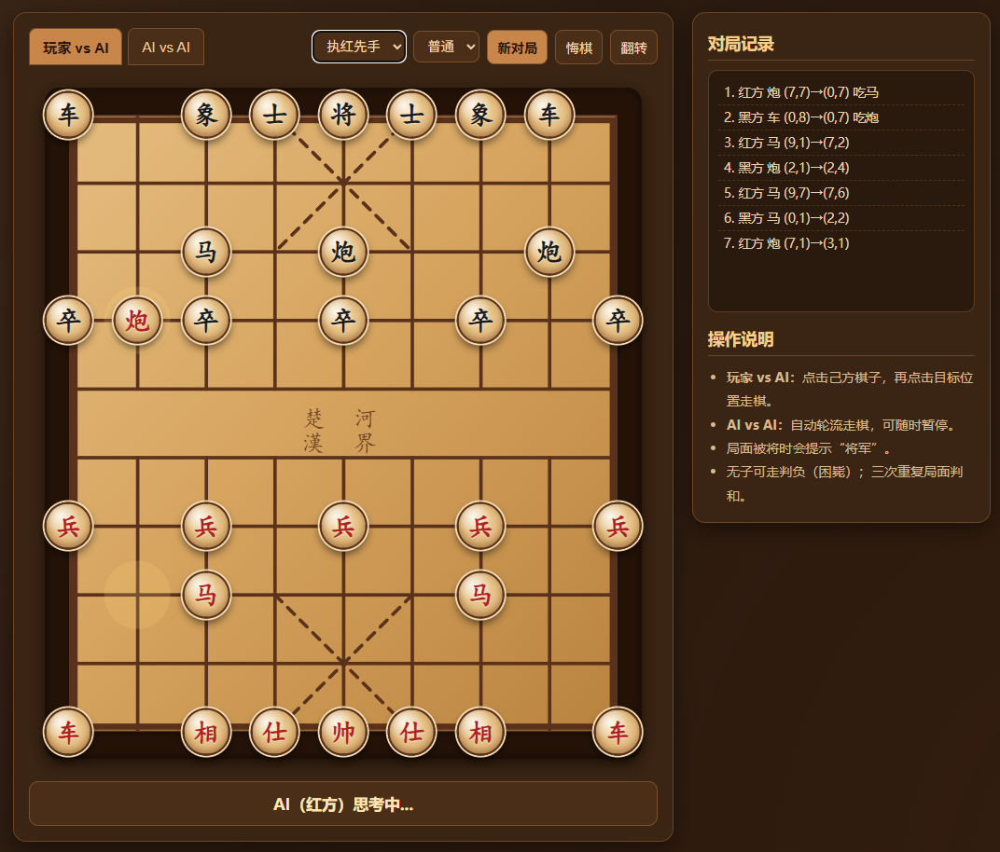
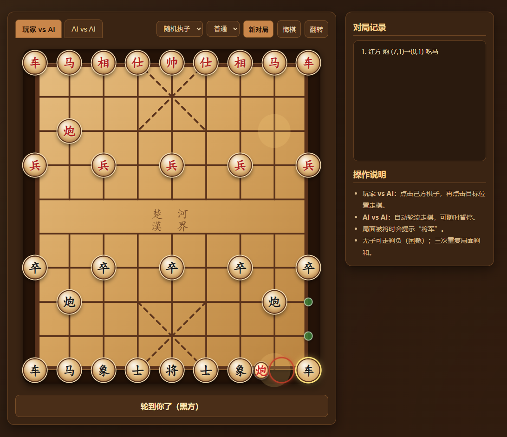
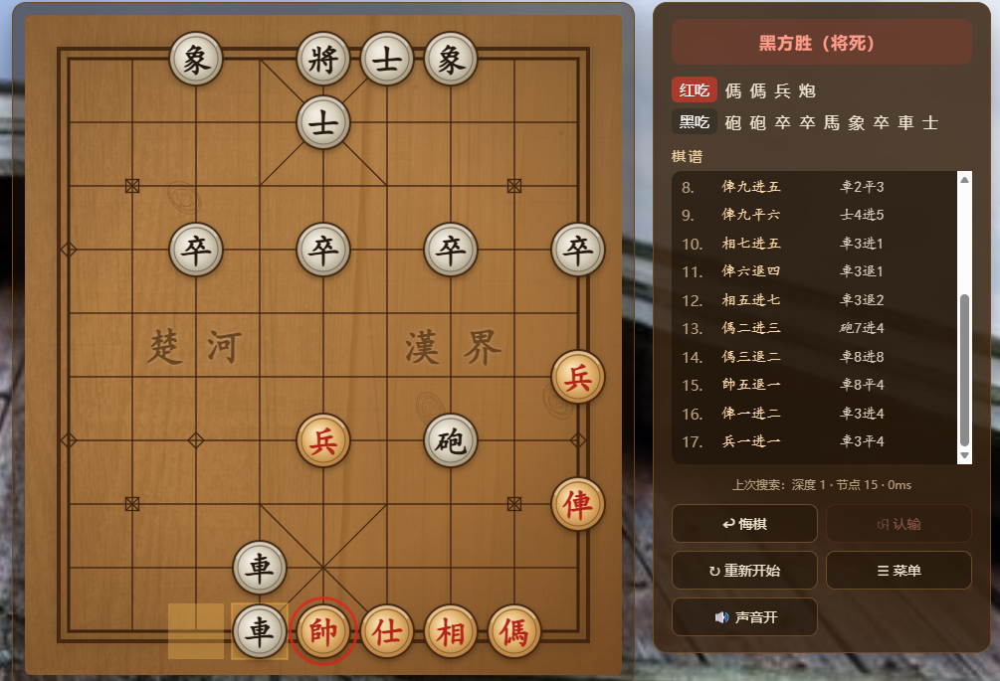
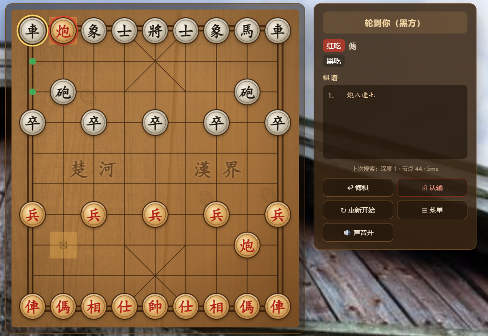

# hard-flash  
> hard-flash  
  
hard-flash is a DeepSeek Harness (dsh) agent preset for making large engineering tasks deliberate, integrated, and verifiable from the first turn.  
hard-flash 是一个面向 DeepSeek Harness（dsh）的 agent preset，目标是在第一轮就让大型工程任务进入深思考、强集成、可验证的工作状态。  
  
**The preset is designed for users who prefer correctness over speed, full capability over toy demonstrations, and real-path verification over code that merely looks plausible**.  
**这个 preset 适合优先追求正确率、完整能力和真实用户路径验证，而不是追求速度或只交付看起来可行的示例的用户**。  
  
The package is intentionally small: the preset composition declares the available dsh tools, while router-bootstrap.mjs controls the first-turn routing and the shared engineering discipline.  
本包有意保持精简：preset composition 负责声明 dsh 工具，router-bootstrap.mjs 负责首轮工具路由和统一的工程执行纪律。  
  
## Background and motivation  
## 背景与动机  
  
hard-flash started from a practical observation: for DeepSeek V4 Flash, visible chain-of-thought style is not a reliable proxy for the quality of the final engineering result.  
hard-flash 源于一个工程观察：对于 DeepSeek V4 Flash，可见的思维链风格并不是最终工程交付质量的可靠代理指标。  
  
The two original GitHub discussions that motivated this direction are [dsh-router-standard issue #18](https://github.com/yjh051108/dsh-router-standard/issues/18) and [v4-flash-godmode-opencode-go issue #2](https://github.com/SheberDavid/v4-flash-godmode-opencode-go/issues/2).  
推动这个方向的两个原始 GitHub 讨论是 [dsh-router-standard issue #18](https://github.com/yjh051108/dsh-router-standard/issues/18) 和 [v4-flash-godmode-opencode-go issue #2](https://github.com/SheberDavid/v4-flash-godmode-opencode-go/issues/2)。  
  
Issue #18 reports a descriptive study of twelve sessions on the same broad task, with one configuration repeated as UP2; it explicitly warns that the sample is small and should not be read as causal proof.  
Issue #18 记录了同一宽泛任务上的十二个会话，其中一个配置以 UP2 形式重复运行；它明确说明样本很小，不能被解读为因果证明。  
  
Its strongest practical signal is that trajectory is not the same thing as quality: the UP and UP2 runs used the same preset shape and showed nearly the same language fingerprint, yet their reported scores were 85.7 and 42.9.  
其中最有工程意义的信号是：思维链不等于质量；UP 和 UP2 使用相同的 preset 形态并表现出几乎相同的语言指纹，但报告分数分别为 85.7 和 42.9。  
  
The same discussion also reports that prompt injection can change phrases such as `we`, `let me`, and `I` without reliably changing the quality of the produced software.  
同一讨论还记录了提示词注入可以改变 `we`、`let me`、`I` 等表达方式，但并不能可靠地改变生成软件的质量。  
  
In that evidence,**prompting behaves more like a behavior switch than a quality switch, while implementation details, verification depth, and accidental failures remain decisive**.  
在这些证据中，**提示词更像是行为开关而不是质量开关，而实现细节、验证深度和偶发失败仍然是决定性因素**。  
  
Issue #2 records a related compatibility question: dsh may preserve the existing system prompt for a non-official DeepSeek API and append `You are a helpful assistant.` instead of deleting or replacing the original prompt.  
Issue #2 记录了相关的兼容性问题：对于非官方 DeepSeek API，dsh 可能保留原有系统提示词，并在后面追加 `You are a helpful assistant.`，而不是删除或覆盖原提示词。  
  
That issue is not a controlled quality benchmark, but it is consistent with the practical observation that **even a small late prompt addition can change model behavior without clearing the original system prompt**.  
这个 issue 不是严格的质量基准实验，但它与一个实践观察相符：**即使不清除原系统提示词，只在后面追加一句很短的提示，也可能改变模型行为**。  
  
Our working hypothesis is therefore stronger than “make the reasoning look deeper”: **Flash quality is often dominated by hallucination rate, missed integration assumptions, and whether verification catches the errors before delivery** .  
因此，我们的工作假设不是“让思维链看起来更深”：**Flash 的质量往往更受幻觉率、遗漏的集成假设以及验证是否能在交付前捕获错误的影响**。  
  
When the same class of task sometimes works and sometimes fails under similar visible reasoning patterns, the experience feels like a draw from a high-variance distribution; we use “抽卡” as shorthand for that run-to-run uncertainty.  
当相似的可见思维链模式下，同类任务有时成功、有时失败时，体验就像从高方差分布中抽取结果；我们用“抽卡”简称这种运行间不确定性。  
  
This is an engineering hypothesis and a design rationale, not a universal theorem about every Flash model, task, or provider configuration.  
这是一个工程假设和设计依据，并不是关于所有 Flash 模型、任务或 provider 配置的普遍定理。  
  
### The deliberate trade-off  
### 有意进行的资源交换  
  
hard-flash responds by trading time and token budget for a lower probability of hallucinated or unverified delivery.  
hard-flash 的应对方式是用更多时间和 token 预算，换取更低的幻觉交付和未经验证交付概率。  
  
In the reported comparison, the same hard-flash prompt used approximately **1.5x wall-clock time, 5x input tokens, and 3x output tokens** compared with the lighter setup.  
在这次对比记录中，同一段 hard-flash 提示词相较于dsh-router-standard 0.2.0 提示词配置大约使用了 **1.5 倍工作时间、5 倍输入 token 和 3 倍输出 token**。  
  
Those ratios are observations from this comparison, not a universal benchmark or a promise for every provider and task.  
这些比例是本次对比中的观察值，不是适用于所有 provider 和任务的通用基准，也不是固定承诺。  
  
The design goal is simple: **spend more budget on inspection, architecture, integration, checkpoints, and real-path verification when correctness matters more than latency**.  
设计目标很直接：**当正确率比延迟更重要时，把更多预算投入到检查、架构、集成、checkpoint 和真实路径验证上**。  
  
### Controlled comparison: a browser Chinese-chess task  
### 受控对比：中国象棋网页任务  
  
**No vision-capable model** was introduced in this comparison; the intended variable was the **system prompt** rather than a model upgrade.  
这次对比没有引入**视觉模型**；有意控制的变量是**系统提示词**，而不是更换模型。  
  
**The task was to build a browser-based Chinese chess game with AI vs AI and player vs AI modes, while researching or fetching suitable materials, assets, and textures online when necessary.**  
**提示词：制作一个网页版中国象棋游戏，有AI vs AI 以及玩家 vs AI，需要资料 素材 纹理等可以联网查找**
  
The baseline used the **dsh-router-standard 0.2.0 prompt** for one turn **without runtime injection**.  
基线使用 **dsh-router-standard 0.2.0** 的提示词运行一轮，并且没有**使用运行时注入**。  
  
The baseline result was visually usable, but the player-vs-AI flow contained a reported bug: changing the difficulty could switch the page back to AI vs AI.  
基线结果在视觉上可用，但玩家 vs AI 流程存在一个已报告的 bug：切换难度后页面可能会变回 AI vs AI。  
  
  
*Figure 1 — Representative baseline result and the player-vs-AI interaction path.*  
*图 1——基线结果及玩家 vs AI 交互路径的代表性截图。*  
  
  
*Figure 1a — Additional baseline screenshot from the same comparison set.*  
*图 1a——同一对比组中的另一张基线截图。*  
  
The hard-flash run used the same task with the **strong engineering prompt** described in this repository.  
hard-flash 运行同一个任务，使用本仓库描述的**强工程约束型系统提示词**。  
  
The resulting interface included a richer board presentation, move history, state controls, and a deeper verification-oriented workflow.  
最终界面包含更丰富的棋盘表现、着法记录、状态控制和更偏向验证的工作流程。  
  
  
*Figure 2 — Representative hard-flash result with board state and move history visible.*  
*图 2——显示棋盘状态和着法记录的 hard-flash 代表性结果。*  
  
  
*Figure 2a — Additional hard-flash screenshot from the same comparison set.*  
*图 2a——同一对比组中的另一张 hard-flash 截图。*  
  
The reported phrase counts were as follows; they are diagnostic signals from the comparison, not a software-quality score.  
这次对比中记录的短语计数如下；它们是诊断信号，不是软件质量分数。  
  
| System prompt / 系统提示词 | Let me | I'll | We | need | Let's |  
|---|---:|---:|---:|---:|---:|  
| hard-flash | 356 | 99 | 198 | 66 | 1 |  
| minimal | 0 | 4 | 218 | 98 | 87 |  
  
**The key design conclusion is not that one phrase pattern is intrinsically better, but that the prompt should force engineering evidence to matter more than conversational style.**  
**关键设计结论不是某一种短语模式天然更好，而是系统提示词应该让工程证据比对话风格更重要**。  
  
hard-flash therefore emphasizes inspect, plan, implement against real interfaces, checkpoint, compile or test, exercise the real user path, and retest after every fix.  
因此，hard-flash 强调 inspect、plan、基于真实接口实现、checkpoint、编译或测试、运行真实用户路径，并在每次修复后重新测试。  
  
### Source links  
### 原始链接  
  
- The primary experimental discussion is [dsh-router-standard issue #18](https://github.com/yjh051108/dsh-router-standard/issues/18).  
- 主要实验讨论是 [dsh-router-standard issue #18](https://github.com/yjh051108/dsh-router-standard/issues/18)。  
- The related system-prompt compatibility discussion is [v4-flash-godmode-opencode-go issue #2](https://github.com/SheberDavid/v4-flash-godmode-opencode-go/issues/2).  
- 相关的系统提示词兼容性讨论是 [v4-flash-godmode-opencode-go issue #2](https://github.com/SheberDavid/v4-flash-godmode-opencode-go/issues/2)。  
  
## What hard-flash changes  
## hard-flash 改变了什么  
  
The router injects one stable engineering prompt instead of relying on a fragile sequence of late, session-specific prompt mutations.  
**注入一段稳定的工程提示词，不依赖脆弱的、晚到的、按会话变化的提示词动态修改**。  
  
The prompt first reconstructs the current context, then requires deep planning, concrete decomposition, exact interface inspection, incremental checkpoints, and real user-facing verification.  
**这段提示词要求模型先重建当前上下文，再进行深度规划、具体拆解、精确接口检查、增量 checkpoint 和真实用户路径验证**。  
  
Broad build requests are expanded into a concrete implementation specification instead of being silently reduced to a toy example, a mockup, or a disconnected proof of concept.  
**宽泛的 build 需求会被展开为具体实现规格，而不是被悄悄缩水成 toy example、表面 mockup 或脱离系统的 proof of concept**。  
  
The model is told to implement against the actual codebase and actual installed interfaces, not against memory, guesses, or invented APIs.  
**模型被要求基于真实代码库和真实安装版本的接口实现，而不是依靠记忆、猜测或虚构 API**。  
  
Every completed file or TODO step is treated as a checkpoint where the surrounding architecture, symbols, signatures, state, call path, and integration assumptions are reviewed again.  
**每完成一个文件或 TODO 步骤都要进行 checkpoint，重新检查周边架构、符号、签名、状态、调用路径和集成假设**。  
  
Verification is a loop: test, debug, fix, and retest until the intended user-facing path works correctly.  
**验证是一个闭环：测试、调试、修复、重新测试，直到预期的真实用户路径正确工作**。  
  
## Three first-turn modes  
## 三种首轮模式  
  
The router initializes different first-turn tools for normal, plan, and goal work, then promotes the session to the full available catalog after a durable tool call.  
路由器会为 normal、plan 和 goal 工作分别初始化不同的首轮工具，并在出现持久化 tool call 后把会话提升到完整可用工具目录。  
  
### normal  
### normal（普通执行）  
  
Normal is the default when plan mode is not active and the request does not contain a long-running goal signal.  
当 plan mode 没有激活且请求没有长任务目标信号时，路由器使用 normal 模式。  
  
The first-turn core is `read`, `write`, `edit`, plus the platform shell (`pwsh` on Windows or `bash` on Unix-like systems).  
normal 首轮核心工具是 `read`、`write`、`edit`，再加上平台 shell（Windows 使用 `pwsh`，类 Unix 系统使用 `bash`）。  
  
This mode is optimized for directly implementing a bounded change while still requiring inspection and verification through the shared prompt.  
这个模式适合直接实现边界清晰的变更，同时仍然受统一提示词约束，必须进行检查和验证。  
  
### plan  
### plan（规划模式）  
  
Plan is selected when the assembled prompt contains an active `plan:policy` section from dsh plan mode.  
当 dsh plan mode 组装出的提示词中存在有效的 `plan:policy` section 时，路由器选择 plan 模式。  
  
The first-turn core is `read`, `glob`, `grep`, and `exit_plan_mode`, plus the platform shell.  
plan 首轮核心工具是 `read`、`glob`、`grep` 和 `exit_plan_mode`，再加上平台 shell。  
  
The plan tool surface intentionally excludes `write` and `edit` during the initial planning pass, so the model can inspect the repository and submit a decision-complete plan before implementation.  
规划首轮有意不暴露 `write` 和 `edit`，让模型先检查仓库并提交一个决策完整的计划，再进入实现阶段。  
  
The plan policy inside agent.cordis.yml keeps plan mode active until `exit_plan_mode` succeeds or the user changes the session mode.  
agent.cordis.yml 内的 plan policy 会让 plan mode 持续到 `exit_plan_mode` 成功，或用户主动切换会话模式为止。  
  
### goal  
### goal（持续目标模式）  
  
Goal is selected when the session already has an active non-complete, non-blocked goal, or when the current request contains a long-running or autonomous-work signal.  
当会话已有未完成且未阻塞的 active goal，或当前请求包含长期运行、自主执行等信号时，路由器选择 goal 模式。  
  
The first-turn core is `read`, `write`, `edit`, the available goal tools (`get_goal`, `create_goal`, and `update_goal`), plus the platform shell.  
goal 首轮核心工具是 `read`、`write`、`edit`、可用的目标工具（`get_goal`、`create_goal`、`update_goal`），再加上平台 shell。  
  
Goal tools are added only when they are present in the dsh catalog, so the router does not manufacture unavailable tools.  
只有当 dsh 工具目录中确实存在 goal 工具时，路由器才会加入这些工具，因此不会虚构不可用的工具。  
  
The classifier recognizes both Chinese and English long-running signals, including continuous work, multi-round iteration, autonomous execution, and until-complete wording.  
目标分类器同时识别中英文长期任务信号，包括持续工作、多轮迭代、自主执行以及“直到完成”等表达。  
  
## Promotion after the first durable tool call  
## 首次持久化工具调用后的提升  
  
Before the first durable `tool/call` event, the router exposes only the mode-specific core surface described above.  
在首次持久化 `tool/call` 事件之前，路由器只暴露上面定义的模式专属核心工具面。  
  
Once a durable tool call exists in the session history, the router returns the assembled tools without the first-turn filter, while keeping the hard-flash persona and plan policy.  
一旦会话历史中出现持久化 tool call，路由器就会移除首轮工具过滤，返回完整组装工具，同时保留 hard-flash persona 和 plan policy。  
  
This creates a narrow, task-focused entry point without permanently taking capabilities away from the agent.  
这样可以得到一个聚焦任务的窄入口，同时不会永久剥夺 agent 的完整能力。  
  
Resumed sessions that already contain a durable tool call are promoted immediately instead of being treated as new empty sessions.  
已经包含持久化 tool call 的恢复会话会立即进入提升状态，不会被当成全新的空会话。  
  
## Engineering execution path  
## 工程执行路径  
  
The intended execution order is deep inspect, deep planning, TODO decomposition, exact-interface inspection, file-by-file implementation, and validation.  
推荐的执行顺序是深度 inspect、深度 planning、TODO decomposition、精确接口检查、逐文件实现和验证。  
  
After each file, the agent performs a full file review and automated validation before moving to the next file.  
每完成一个文件，agent 都要进行完整文件复核和自动化验证，然后再继续下一个文件。  
  
After each TODO, the agent performs a cross-file integration review and revises the plan if new evidence changes the architecture.  
每完成一个 TODO，agent 都要进行跨文件集成复核；如果新证据改变了架构，就要修订计划。  
  
The final phase exercises the real user-facing path, then enters the test, debug, fix, and retest loop whenever anything is wrong.  
最后阶段会运行真实用户路径；如果发现任何问题，就进入测试、调试、修复、重新测试的闭环。  
  
The priority order is correctness, capability, time, and token efficiency.  
优先级排序是**正确率 ＞ 能力发挥 ＞ 时间和 ＞ token 效率**。  
  
## Repository contents  
## 仓库文件  
  
`agent.cordis.yml` declares the dsh composition, including platform shells, filesystem tools, goals, plan mode, compaction, delegation, workflow, web, and task tools.  
`agent.cordis.yml` 声明 dsh composition，包括平台 shell、文件系统工具、目标工具、plan mode、压缩、委派、workflow、web 和任务工具。  
  
`router-bootstrap.mjs` injects the shared prompt, classifies the request, selects the first-turn tool set, and promotes the session after a durable tool call.  
`router-bootstrap.mjs` 注入统一提示词、分类请求、选择首轮工具集，并在持久化 tool call 后提升会话能力。  
  
`preset.yml` gives the preset its display name, description, and load order inside the dsh preset system.  
`preset.yml` 为 preset 提供 dsh preset 系统中的显示名称、描述和加载顺序。  
  
`install.sh` installs the preset on Linux and other Unix-like systems without requiring additional packages.  
`install.sh` 在 Linux 和其他类 Unix 系统上安装 preset，不需要额外依赖包。  
  
`install.ps1` installs the same files on Windows PowerShell and verifies the copied contents with SHA-256 hashes.  
`install.ps1` 在 Windows PowerShell 上安装同一组文件，并使用 SHA-256 校验复制后的内容。  
  
`.gitattributes` keeps shell and source files in LF format so the Linux installer remains executable after a cross-platform Git checkout.  
`.gitattributes` 固定 shell 和源码文件使用 LF 格式，避免跨平台 Git checkout 后 Linux 安装脚本因换行符变化而无法执行。  
  
`assets/` stores the four comparison screenshots referenced by this README, using repository-relative paths that render on GitHub.  
`assets/` 保存本 README 引用的四张对比截图，并使用可在 GitHub 正常渲染的仓库相对路径。  
  
## Requirements  
## 运行要求  
  
You need a dsh installation that supports agent presets, Cordis composition files, the `system-prompt/assemble` hook, and the tool names referenced by agent.cordis.yml.  
你需要安装支持 agent preset、Cordis composition 文件、`system-prompt/assemble` hook 以及 agent.cordis.yml 中工具名称的 dsh 版本。  
  
The hard-flash package does not install dsh, model providers, credentials, or external plugins for you.  
hard-flash 不会代替你安装 dsh、模型 provider、凭据或外部插件。  
  
The router is JavaScript and is loaded by dsh; the deployment scripts only use shell or PowerShell built-ins plus standard file-copy commands.  
路由器是由 dsh 加载的 JavaScript；部署脚本只使用 shell 或 PowerShell 内置能力以及标准文件复制命令。  
  
The preset expects the dsh tool catalog to provide at least one platform shell, otherwise the router reports `router-bootstrap: no platform shell in catalog`.  
这个 preset 至少要求 dsh 工具目录提供一个平台 shell，否则路由器会报告 `router-bootstrap: no platform shell in catalog`。  
  
## Linux installation  
## Linux 安装  
  
Clone or download this repository, enter its root directory, and run the installer.  
克隆或下载本仓库，进入仓库根目录，然后运行安装脚本。  
  
```bash  
chmod +x install.sh  
./install.sh  
```  
  
You can also invoke it through Bash when executable permissions have not been preserved by the download method.  
如果下载方式没有保留可执行权限，也可以通过 Bash 直接调用。  
  
```bash  
bash install.sh  
```  
  
The default destination is `~/.dsh/.agent-presets/hard-flash`.  
默认目标目录是 `~/.dsh/.agent-presets/hard-flash`。  
  
The installer updates only `agent.cordis.yml`, `preset.yml`, and `router-bootstrap.mjs`; it does not delete the preset directory or rewrite unrelated files.  
安装脚本只更新 `agent.cordis.yml`、`preset.yml` 和 `router-bootstrap.mjs`，不会删除 preset 目录，也不会改写无关文件。  
  
Use `--dsh-root` when dsh stores its configuration under a non-standard directory.  
如果 dsh 使用非标准配置目录，可以使用 `--dsh-root`。  
  
```bash  
bash install.sh --dsh-root /path/to/.dsh  
```  
  
Use `--preset-name` if you intentionally want to install a copy under another preset name.  
如果你确实要使用另一个 preset 名称安装副本，可以使用 `--preset-name`。  
  
```bash  
bash install.sh --preset-name hard-flash-dev  
```  
  
Use `--dry-run` to inspect the destination without creating or copying files.  
使用 `--dry-run` 可以只查看目标路径，不创建或复制文件。  
  
```bash  
bash install.sh --dry-run  
```  
  
## Windows installation  
## Windows 安装  
  
Open PowerShell in the repository root and run the installer.  
在仓库根目录打开 PowerShell，然后运行安装脚本。  
  
```powershell  
.\install.ps1  
```  
  
If the current process policy blocks local scripts, allow scripts only for the current PowerShell process and run the installer again.  
如果当前进程策略阻止本地脚本，可以只为当前 PowerShell 进程临时放行，然后重新运行安装脚本。  
  
```powershell  
Set-ExecutionPolicy -Scope Process -ExecutionPolicy Bypass  
.\install.ps1  
```  
  
The default Windows destination is `C:\Users\<YourUser>\.dsh\.agent-presets\hard-flash`.  
Windows 默认目标目录是 `C:\Users\<你的用户名>\.dsh\.agent-presets\hard-flash`。  
  
For the supplied machine, the expected destination is `C:\Users\wang\.dsh\.agent-presets\hard-flash`.  
对于你提供的机器，预期目标目录就是 `C:\Users\wang\.dsh\.agent-presets\hard-flash`。  
  
The Windows installer does not depend on the current working directory because it resolves the source files relative to `install.ps1`.  
Windows 安装脚本不依赖当前工作目录，因为它会相对于 `install.ps1` 定位源文件。  
  
Use `-DshRoot`, `-PresetName`, or `-DryRun` for non-default deployments.  
非默认部署可以使用 `-DshRoot`、`-PresetName` 或 `-DryRun`。  
  
```powershell  
.\install.ps1 -DshRoot 'D:\dsh' -PresetName 'hard-flash-dev'  
.\install.ps1 -DryRun  
```  
  
The Windows script compares each source file with its copied destination and fails if any hash differs.  
Windows 脚本会逐个比较源文件和目标文件，如果任何哈希不一致就会失败。  
  
## Selecting hard-flash as the default  
## 将 hard-flash 设为默认 preset  
  
The installers intentionally do not rewrite settings.yaml because dsh versions and user configuration layouts can differ, and an automatic YAML rewrite could damage unrelated settings.  
安装脚本有意不自动改写 settings.yaml，因为不同 dsh 版本和用户配置布局可能不同，自动重写 YAML 可能破坏无关配置。  
  
After installation, add or merge the following setting in your dsh configuration when your version uses the standard preset layout.  
安装完成后，如果你的 dsh 版本使用标准 preset 配置格式，请在配置中添加或合并下面的内容。  
  
```yaml  
agent-presets:  
  default: hard-flash  
```  
  
If your configuration already contains an `agent-presets` mapping, preserve its other keys and change only the default value.  
如果配置中已经存在 `agent-presets` 映射，请保留其他键，只修改 default 值。  
  
If your dsh version selects presets through a different command or UI, select `hard-flash` there instead of copying this snippet literally.  
如果你的 dsh 版本通过其他命令或界面选择 preset，请在那里选择 `hard-flash`，不要机械照抄这段配置。  
  
Restart dsh after changing the active preset so the new composition is mounted for new sessions.  
修改 active preset 后请重启 dsh，让新 composition 在新会话中挂载。  
  
## How to use it  
## 使用方式  
  
Start a new dsh session after installation and submit the task normally; the router reads the session state and chooses the first-turn mode.  
安装后启动新的 dsh 会话，像平常一样提交任务；路由器会读取会话状态并选择首轮模式。  
  
Use ordinary bounded implementation wording for normal work, such as “add a validation command and test it”.  
普通边界清晰的工作可以直接使用 normal 请求，例如“增加一个校验命令并测试它”。  
  
Use explicit plan mode when you want repository inspection and a decision-complete implementation plan before edits.  
如果你希望先检查仓库并得到决策完整的实现计划，再开始修改，请显式进入 plan mode。  
  
Use goal semantics for work that should continue across rounds, such as “keep iterating until the feature is complete and verified”.  
如果任务需要跨多轮持续推进，可以使用 goal 语义，例如“持续迭代，直到功能完成并验证通过”。  
  
The classifier uses the durable inbox splice history rather than guessing from a transient local variable, which also makes resumed sessions more reliable.  
分类器使用持久化 inbox splice 历史，而不是依赖瞬时局部变量，这也让恢复会话更可靠。  
  
## Verification checklist  
## 验证清单  
  
Confirm that the three preset files exist under the expected `.agent-presets/hard-flash` directory.  
确认三个 preset 文件已经出现在预期的 `.agent-presets/hard-flash` 目录中。  
  
Confirm that the preset metadata still names the preset `hard-flash` and does not contain a conflicting load order.  
确认 preset 元数据仍然使用 `hard-flash` 名称，并且没有冲突的加载顺序。  
  
Start a fresh session and verify that the normal first turn exposes `read`, `write`, `edit`, and the platform shell.  
启动新会话，确认 normal 首轮暴露 `read`、`write`、`edit` 和平台 shell。  
  
Enter plan mode and verify that the first planning turn exposes `read`, `glob`, `grep`, `exit_plan_mode`, and the platform shell, but not `write` or `edit`.  
进入 plan mode，确认规划首轮暴露 `read`、`glob`、`grep`、`exit_plan_mode` 和平台 shell，但不暴露 `write` 或 `edit`。  
  
Create or resume a goal and verify that the first goal turn includes the available goal lifecycle tools.  
创建或恢复一个 goal，确认 goal 首轮包含可用的目标生命周期工具。  
  
After the first durable tool call, verify that the full dsh catalog is available and that the router persona remains present.  
首次持久化 tool call 后，确认完整 dsh 工具目录可用，并且路由器 persona 仍然存在。  
  
For a real build, inspect the generated or changed files, run the relevant type checker, compiler, linter, or targeted tests, and then exercise the actual user-facing path.  
对于真实 build，请检查生成或修改后的文件，运行相关 type checker、compiler、linter 或 targeted tests，然后运行真实用户路径。  
  
If any check fails, debug the cause, fix the implementation, and repeat the verification loop instead of stopping at the first plausible result.  
如果任何检查失败，请调查原因、修复实现并重复验证闭环，不要在第一个看似可行的结果处停止。  
  
## Failure modes and recovery  
## 故障模式与恢复  
  
If the router reports that no platform shell exists, inspect agent.cordis.yml and confirm that the dsh host composition exposes `bash` on Unix or `pwsh` on Windows.  
如果路由器报告没有平台 shell，请检查 agent.cordis.yml，并确认 dsh host composition 在类 Unix 系统暴露 `bash`、在 Windows 暴露 `pwsh`。  
  
If a goal tool is missing, the router filters it out rather than fabricating it; install or enable the dsh goal tool if goal lifecycle operations are required.  
如果缺少 goal 工具，路由器会将其过滤掉而不是虚构它；如果需要目标生命周期操作，请安装或启用 dsh goal 工具。  
  
If plan tools are missing, verify that dsh plan mode registers `plan:policy` and `exit_plan_mode` under the names used by this preset.  
如果缺少 plan 工具，请确认 dsh plan mode 注册了本 preset 使用的 `plan:policy` 和 `exit_plan_mode` 名称。  
  
If the preset loads but the model does not follow the expected behavior, inspect the assembled system prompt and the durable session events before changing the router.  
如果 preset 能加载但模型没有表现出预期行为，请先检查组装后的 system prompt 和持久化会话事件，再修改路由器。  
  
If a newer dsh release changes event names, tool names, or the assembly contract, update the router against the installed definitions instead of guessing compatibility.  
如果新版 dsh 改变了事件名、工具名或 assembly contract，请根据实际安装版本的定义更新路由器，不要猜测兼容性。  
  
## Updating and uninstalling  
## 更新与卸载  
  
To update an existing installation, replace the repository files with the new version and run the same installer again.  
要更新已有安装，只需将仓库文件替换为新版本，然后再次运行相同的安装脚本。  
  
The installers overwrite only the three files owned by this repository and leave unrelated files in the target preset directory untouched.  
安装脚本只覆盖本仓库管理的三个文件，目标 preset 目录中的无关文件会保留。  
  
To disable the preset, select another dsh preset or remove the `agent-presets.default` selection from your configuration.  
要停用 preset，请选择其他 dsh preset，或从配置中移除 `agent-presets.default` 的选择。  
  
If you want to remove the installed preset directory after confirming it contains no user-added files, remove only the `hard-flash` directory under `.agent-presets`.  
如果确认安装目录中没有用户添加的文件，可以只删除 `.agent-presets` 下的 `hard-flash` 目录来移除 preset。  
  
Do not delete the whole `.dsh` directory merely to uninstall this preset, because that may remove unrelated dsh settings, credentials, caches, or other presets.  
不要为了卸载这个 preset 而删除整个 `.dsh` 目录，因为那可能同时删除无关的 dsh 设置、凭据、缓存或其他 preset。  
  
## Design notes  
## 设计说明  
  
The router keeps the shared Base prompt stable across all modes and preserves the plan policy section supplied by dsh.  
路由器在所有模式中保持统一 Base 提示词稳定，并保留 dsh 提供的 plan policy section。  
  
The request classifier checks plan mode first, then active goal state, then long-running goal signals, and finally falls back to normal.  
请求分类器先检查 plan mode，再检查 active goal 状态，然后检查长期任务信号，最后回退到 normal。  
  
The active goal fold understands goal change events, including clearing a goal and terminal complete or blocked phases.  
active goal 折叠逻辑理解 goal change 事件，包括清除目标以及 complete 或 blocked 终态。  
  
The shell is selected from the assembled catalog, preferring `pwsh` when available and otherwise using `bash`.  
shell 会从组装后的工具目录中选择，优先使用可用的 `pwsh`，否则使用 `bash`。  
  
The composition preserves the host-plane behavior documented in the original preset, including shell environment, registries, persistence, and model routing boundaries.  
composition 保留原始 preset 中记录的 host-plane 行为，包括 shell environment、registry、持久化和模型路由边界。  
  
Do not move host-plane services into an entry-local realm casually, because registry lifetime and cross-session visibility are part of the dsh integration contract.  
不要随意把 host-plane service 移进 entry-local realm，因为 registry 生命周期和跨会话可见性属于 dsh 集成契约的一部分。  
  
## Repository status  
## 仓库状态  
  
The repository contains the deployable preset files and does not require a build step or generated artifact.  
本仓库包含可直接部署的 preset 文件，不需要构建步骤或生成制品。  
  
The four PNG files under `assets/` are documentation evidence only; the installers do not copy them into the dsh preset directory.  
`assets/` 下的四张 PNG 图片只用于文档证据；安装脚本不会把它们复制到 dsh preset 目录。  
  
The deployment scripts perform local file validation, but runtime compatibility still depends on the installed dsh release and enabled plugin catalog.  
部署脚本会执行本地文件校验，但运行时兼容性仍取决于已安装的 dsh 版本和启用的插件目录。  
  
When publishing to GitHub, commit all seven root files and all four PNG files under `assets/` so the relative `./router-bootstrap.mjs` import and screenshot links remain valid.  
发布到 GitHub 时，请同时提交根目录七个文件和 `assets/` 下的四张 PNG 图片，以保证相对路径 `./router-bootstrap.mjs` import 和截图链接都有效。  
  
No license has been added automatically because the supplied hard-flash package did not include a license declaration; add the license that matches your intended distribution before publishing.  
由于你提供的 hard-flash 包没有包含许可证声明，本仓库没有自动添加 license；正式发布前请补充符合你分发意图的许可证。  
  
## Credits  
## 致谢  
  
https://github.com/xiaobright/dsh-anchored-standard  
https://github.com/yjh051108/dsh-router-standard  
